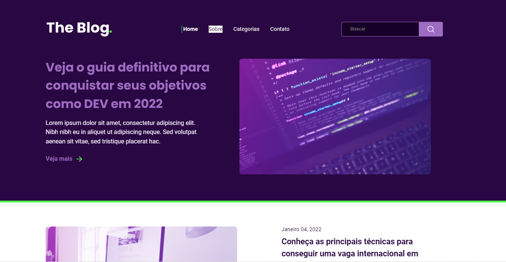

<h1 align="center"> Rocket Blog </h1>

Aplicação desenvolvida para submissão no discover, programa para ensino de tecnologias WEB promovido pela Rocketseat .

🔗 <a href="https://johnwilker.github.io/rocketBlog">Clique aqui para acessar a página do projeto</a>

  <a href="#-tecnologias">Tecnologias</a>&nbsp;&nbsp;&nbsp;|&nbsp;&nbsp;&nbsp;
  <a href="#-projeto">Projeto</a>&nbsp;&nbsp;&nbsp;|&nbsp;&nbsp;&nbsp;
  <a href="#-layout">Layout</a>

 

  <strong>Desktop</strong>
  

  
  <strong>Mobile</strong> 
  

## 🚀 Tecnologias

Esse projeto foi desenvolvido com as seguintes tecnologias:

- HTML
- CSS

## 💻 Projeto

O Rocket Blog é uma página que simula uma página de um blog contendo um menu de navegação para acesso as demais páginas do blog, além de artigos relacionados ao tema do blog.

## 🔖 Layout

Você pode visualizar o layout do projeto através [DESSE LINK](https://www.figma.com/file/ik9ym0hDOaZtyPoB4Eh1i2/DD-%2F-RocketBlog). É necessário ter conta no [Figma](https://figma.com) para acessá-lo.

---

Feito com ♥ by John :wave: [Participe da comunidade Rocketseat!](https://discord.gg/rocketseat)
